# Dependency Graph & Initialization Flow

This diagram shows how the dependency graph is built, circular dependencies are detected, and services are initialized in the correct order.

```mermaid
flowchart TD
    A[ServiceLifecycleManager.InitializeAllAsync] --> B[container.BuildDependencyGraph]
    
    B --> C[ServiceDependencyGraph.Build]
    C --> D[Clear Previous Data]
    D --> E[Define Infrastructure Types]
    E --> F[Create Service Nodes]
    
    F --> G[Iterate Registrations]
    G --> H{Is Infrastructure Type?}
    H -->|Yes| I[Skip and Log]
    H -->|No| J[Create ServiceNode]
    
    J --> K[Build Dependency Edges]
    K --> L[Iterate Service Nodes]
    L --> M[Process Required Dependencies]
    M --> N{Is Infrastructure Dependency?}
    N -->|Yes| O[Skip Dependency]
    N -->|No| P{Dependency Node Exists?}
    P -->|Yes| Q[Add Dependency Edge]
    P -->|No| R[Skip Missing Dependency]
    
    Q --> S[Process Optional Dependencies]
    S --> T{Is Infrastructure Dependency?}
    T -->|Yes| U[Skip Dependency]
    T -->|No| V{Dependency Node Exists?}
    V -->|Yes| W[Add Optional Edge]
    V -->|No| X[Skip Missing Optional]
    
    W --> Y[DetectCircularDependencies]
    O --> Y
    R --> Y
    U --> Y
    X --> Y
    
    Y --> Z[Initialize Cycle Detection]
    Z --> AA[Iterate All Nodes]
    AA --> BB{Node Visited?}
    BB -->|No| CC[DetectCycles Recursively]
    BB -->|Yes| DD[Continue to Next Node]
    
    CC --> EE[Mark Node as Visited and InStack]
    EE --> FF[Iterate Dependencies]
    FF --> GG{Dependency Visited?}
    GG -->|No| HH[Recursive DetectCycles]
    GG -->|Yes and InStack| II[Found Cycle!]
    GG -->|Yes and Not InStack| JJ[Continue]
    
    II --> KK[Extract Cycle Path]
    KK --> LL[Add to CircularDependencies]
    HH --> MM[Return Cycle Found]
    JJ --> NN[Continue Processing]
    
    MM --> OO[Mark Node as Not InStack]
    LL --> OO
    NN --> OO
    
    DD --> PP{More Nodes?}
    OO --> PP
    PP -->|Yes| AA
    PP -->|No| QQ{Has Circular Dependencies?}
    
    QQ -->|Yes| RR[Skip Depth Calculation]
    QQ -->|No| SS[CalculateDepths]
    
    RR --> TT[Set All Depths to 0]
    RR --> UU[Log Warning]
    
    SS --> VV[Iterate All Nodes]
    VV --> WW{Node Depth Calculated?}
    WW -->|No| XX[CalculateDepth Recursively]
    WW -->|Yes| YY[Continue to Next]
    
    XX --> ZZ[Initialize Path Tracking]
    ZZ --> AAA{Node in Current Path?}
    AAA -->|Yes| BBB[Circular Dependency Found!]
    AAA -->|No| CCC{Has Dependencies?}
    
    BBB --> DDD[Log Error and Return Depth 0]
    CCC -->|No| EEE[Set Depth 0]
    CCC -->|Yes| FFF[Add Node to Path]
    
    FFF --> GGG[Calculate Max Dependency Depth]
    GGG --> HHH[Set Depth = Max + 1]
    HHH --> III[Remove Node from Path]
    
    EEE --> JJJ[Return to Main Loop]
    DDD --> JJJ
    III --> JJJ
    YY --> JJJ
    
    JJJ --> KKK{More Nodes for Depth?}
    KKK -->|Yes| VV
    KKK -->|No| LLL[Depth Calculation Complete]
    
    TT --> MMM[Build Complete]
    UU --> MMM
    LLL --> MMM
    
    MMM --> NNN{Has Circular Dependencies?}
    NNN -->|Yes| OOO[Initialization Failed]
    NNN -->|No| PPP[GetInitializationOrder]
    
    OOO --> QQQ[Return Failure Report]
    PPP --> RRR[Topological Sort]
    RRR --> SSS[Initialize Services in Order]
    
    %% Parallel Branch for Service Initialization
    SSS --> TTT[For Each Service in Order]
    TTT --> UUU[Resolve Service Instance]
    UUU --> VVV[Call InitializeAsync]
    VVV --> WWW{Initialization Success?}
    WWW -->|Yes| XXX[Mark as Initialized]
    WWW -->|No| YYY[Log Error and Continue]
    
    XXX --> ZZZ{More Services?}
    YYY --> ZZZ
    ZZZ -->|Yes| TTT
    ZZZ -->|No| AAAA[All Services Processed]
    
    AAAA --> BBBB[Return Initialization Report]
    QQQ --> BBBB
    
    %% Styling
    classDef startEnd fill:#e8f5e8
    classDef process fill:#e3f2fd
    classDef decision fill:#fff3e0
    classDef error fill:#ffebee
    classDef critical fill:#fce4ec
    
    class A,BBBB startEnd
    class B,C,D,E,F,J,K,M,Q,S,W,Y,Z,EE,FF,KK,LL,SS,VV,XX,ZZ,FFF,GGG,HHH,III,LLL,MMM,PPP,RRR,SSS,TTT,UUU,VVV,XXX process
    class H,N,P,T,V,BB,GG,QQ,WW,AAA,CCC,NNN,WWW,ZZZ decision
    class I,O,R,U,X,DD,JJ,NN,YY,YYY error
    class II,BBB,DDD,OOO,QQQ critical
```

## Key Components

### 1. Dependency Graph Building
- **Infrastructure Filtering**: Excludes IServiceProvider, IServiceContainer from analysis
- **Node Creation**: Creates ServiceNode for each registered service
- **Edge Building**: Connects nodes based on Required and Optional dependencies

### 2. Circular Dependency Detection
- **DFS Algorithm**: Uses depth-first search with stack tracking
- **Cycle Extraction**: Captures the exact dependency path causing cycles
- **Multiple Cycles**: Can detect and report multiple circular dependencies

### 3. Depth Calculation
- **Recursive Protection**: Prevents stack overflow during depth calculation
- **Topological Ordering**: Calculates initialization order based on dependency depth
- **Safe Fallback**: Sets depth to 0 if circular dependencies are detected

### 4. Service Initialization
- **Ordered Initialization**: Services are initialized based on dependency order
- **Error Resilience**: Continues initializing other services if one fails
- **Detailed Reporting**: Provides comprehensive initialization reports

### 5. Critical Decision Points
- **Circular Dependencies Found**: Engine initialization fails completely
- **Missing Dependencies**: Logged but doesn't stop initialization
- **Infrastructure Dependencies**: Filtered out to prevent self-references