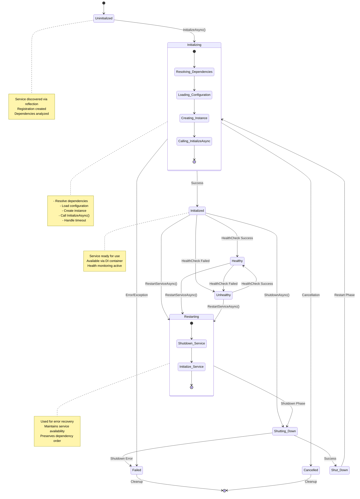
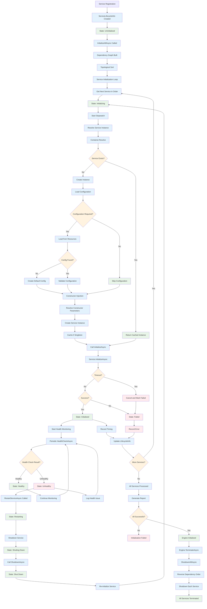

# Service Lifecycle Management

This diagram shows the complete lifecycle of services from registration through initialization, health monitoring, and shutdown.

## Service State Diagram

## Service State Transitions Flow

## Key Lifecycle Phases

### 1. Registration Phase
- Services discovered via reflection
- `ServiceLifecycleInfo` objects created
- Initial state set to `Uninitialized`

### 2. Initialization Phase
- Services resolved in dependency order
- Configuration loaded and validated
- Service instances created via DI
- `InitializeAsync()` called with timeout protection

### 3. Runtime Phase
- Services available via `Engine.GetService<T>()`
- Periodic health monitoring
- State transitions between Healthy/Unhealthy
- Error recovery via restart mechanism

### 4. Shutdown Phase
- Services shut down in reverse dependency order
- Each service's `ShutdownAsync()` called
- Resources cleaned up and disposed

### 5. Error Handling
- Individual service failures don't stop engine
- Failed services marked and reported
- Restart capability for error recovery
- Comprehensive logging and diagnostics