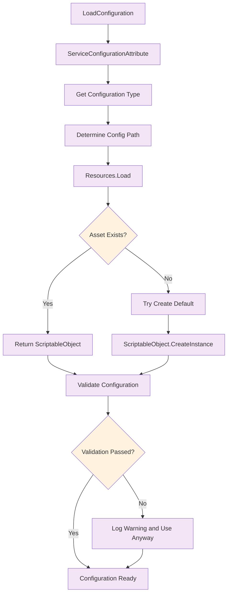
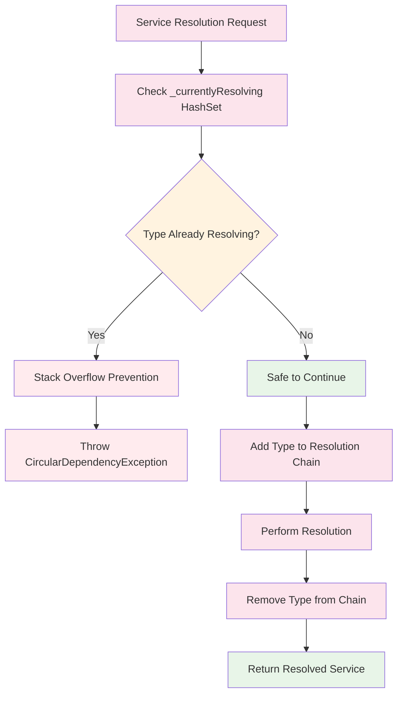

# Dependency Injection Flow

This diagram shows the complete dependency injection and resolution process, including configuration loading and circular dependency protection.

```mermaid
flowchart TD
    A[Service Requests Dependency] --> B[Engine.GetService<T>]
    B --> C[ServiceContainer.Resolve<T>]
    
    C --> D{Container Disposed?}
    D -->|Yes| E[Throw ObjectDisposedException]
    D -->|No| F[Lock Resolution]
    
    F --> G{In Resolution Chain?}
    G -->|Yes| H[Throw CircularDependencyException]
    G -->|No| I[Add to Resolution Chain]
    
    I --> J[ResolveInternal]
    J --> K{Service Registered?}
    K -->|No| L[Throw Service Not Registered]
    K -->|Yes| M[Get ServiceRegistration]
    
    M --> N{Lifetime Type?}
    N -->|Singleton| O{Cached Instance?}
    N -->|Transient| P[CreateInstance]
    N -->|Scoped| Q[Not Implemented Error]
    
    O -->|Yes| R[Return Cached]
    O -->|No| S[Lock Singleton Creation]
    S --> T{Double-Check Cache}
    T -->|Found| U[Return Instance]
    T -->|Not Found| V[CreateInstance and Cache]
    
    P --> W[Create New Instance]
    V --> W
    
    W --> X{Has Factory?}
    X -->|Yes| Y[Use Factory Function]
    X -->|No| Z[Reflection-Based Creation]
    
    Y --> AA[Factory(IServiceProvider)]
    Z --> BB[Get Configuration Type]
    
    BB --> CC{Needs Configuration?}
    CC -->|Yes| DD[LoadConfiguration]
    CC -->|No| EE[Find Constructor]
    
    DD --> FF[Get Config Path]
    FF --> GG[Load from Resources]
    GG --> HH{Config Found?}
    HH -->|Yes| II[Validate Config]
    HH -->|No| JJ{Required?}
    
    JJ -->|Yes| KK[Throw Missing Config]
    JJ -->|No| LL[Create Default]
    
    II --> MM{Validation Passed?}
    MM -->|Yes| EE
    MM -->|No| NN[Log Warning and Continue]
    LL --> EE
    NN --> EE
    
    EE --> OO[Get Constructors]
    OO --> PP{Constructors Found?}
    PP -->|No| QQ[Throw No Constructors]
    PP -->|Yes| RR[Sort by Parameter Count]
    
    RR --> SS[Try Each Constructor]
    SS --> TT[Get Parameters]
    TT --> UU[Resolve Each Parameter]
    
    UU --> VV{Parameter Type?}
    VV -->|Configuration| WW[Use Loaded Config]
    VV -->|Service Dependency| XX[Recursive Resolve]
    VV -->|Has Default| YY[Use Default Value]
    VV -->|Cannot Resolve| ZZ[Try Next Constructor]
    
    WW --> AAA[Add to Parameter Array]
    XX --> BBB{Resolve Success?}
    BBB -->|Yes| AAA
    BBB -->|No| ZZ
    YY --> AAA
    
    AAA --> CCC{All Parameters Resolved?}
    CCC -->|Yes| DDD[Create Instance with Activator]
    CCC -->|No| ZZ
    
    ZZ --> EEE{More Constructors?}
    EEE -->|Yes| SS
    EEE -->|No| FFF[Try Parameterless Constructor]
    
    FFF --> GGG{Success?}
    GGG -->|Yes| HHH[Return Instance]
    GGG -->|No| III[Throw Cannot Create]
    
    DDD --> HHH
    AA --> HHH
    R --> HHH
    U --> HHH
    
    HHH --> JJJ[Remove from Resolution Chain]
    JJJ --> KKK[Return Service Instance]
    
    %% Error Paths
    E --> LLL[Error End]
    H --> LLL
    L --> LLL
    Q --> LLL
    KK --> LLL
    QQ --> LLL
    III --> LLL
    
    %% Styling
    classDef entryPoint fill:#e8f5e8
    classDef process fill:#e3f2fd
    classDef decision fill:#fff3e0
    classDef error fill:#ffebee
    classDef success fill:#e8f5e8
    classDef config fill:#f3e5f5
    
    class A,B entryPoint
    class C,F,I,J,M,P,S,V,W,Z,BB,DD,EE,FF,GG,OO,RR,SS,TT,UU,AAA,DDD,JJJ process
    class D,G,K,N,O,T,X,CC,HH,JJ,MM,PP,VV,BBB,CCC,EEE,GGG decision
    class E,H,L,Q,KK,QQ,III,LLL error
    class R,U,HHH,KKK success
    class DD,FF,GG,II,LL,NN config
```

## Configuration Loading Details



## Circular Dependency Protection



## Key Features

### 1. Service Lifetimes
- **Singleton**: Single instance shared across all requests
- **Transient**: New instance created for each request
- **Scoped**: Not yet implemented, throws error

### 2. Constructor Injection
- Automatically resolves constructor parameters
- Supports configuration injection
- Falls back to parameterless constructor
- Tries constructors in order of parameter count

### 3. Configuration System
- Type-safe ScriptableObject configurations
- Automatic loading from Resources folder
- Default configuration creation
- Validation with error reporting

### 4. Circular Dependency Protection
- Runtime detection during resolution
- Thread-safe resolution chain tracking
- Immediate failure with clear error message
- Prevents stack overflow scenarios

### 5. Error Handling
- Multiple fallback strategies
- Detailed error messages
- Graceful degradation where possible
- Comprehensive logging for diagnostics