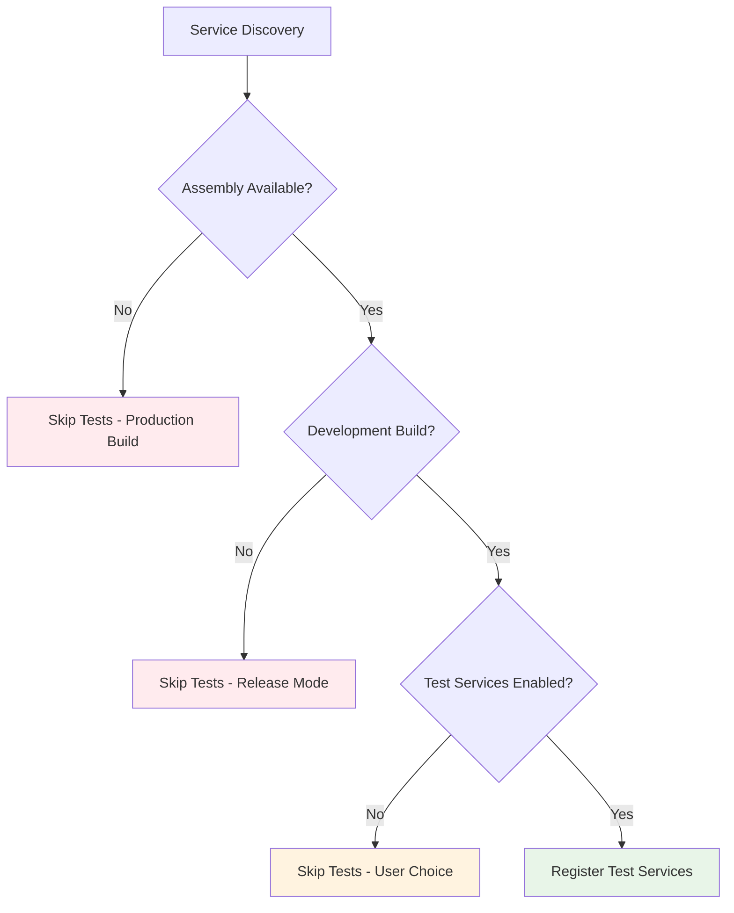

# Test Exclusion Strategies

## Overview

This document outlines various strategies to exclude test code from production builds while keeping them available for development.

## Strategy 1: Assembly Definition Exclusion ✅ (Current)

### How It Works
```json
{
    "name": "Sinkii09.Engine.Test",
    "excludePlatforms": [
        "Android", "iOS", "WindowsStandalone64", 
        // ... all runtime platforms
    ],
    "defineConstraints": ["UNITY_INCLUDE_TESTS"]
}
```

### Pros:
- ✅ **Zero runtime impact** - Tests completely excluded from builds
- ✅ **Unity built-in support** - No custom code needed
- ✅ **Clean separation** - Tests in separate assembly
- ✅ **IDE integration** - Works with Unity Test Runner

### Cons:
- ❌ **Always excluded** - Can't toggle at runtime
- ❌ **Build-time only** - No development flexibility

## Strategy 2: Conditional Compilation

### Implementation
```csharp
#if UNITY_INCLUDE_TESTS || DEVELOPMENT_BUILD
[EngineService(Priority = ServicePriority.Low)]
public class TestService : IEngineService 
{
    // Test service implementation
}
#endif
```

### Define Symbols Management
```csharp
// EditorScript to toggle test symbols
#if UNITY_EDITOR
public static class TestToggle 
{
    [MenuItem("Engine/Toggle Tests")]
    public static void ToggleTests()
    {
        var symbols = PlayerSettings.GetScriptingDefineSymbolsForGroup(
            BuildTargetGroup.Standalone);
        
        if (symbols.Contains("ENABLE_ENGINE_TESTS"))
            symbols = symbols.Replace("ENABLE_ENGINE_TESTS", "");
        else
            symbols += ";ENABLE_ENGINE_TESTS";
            
        PlayerSettings.SetScriptingDefineSymbolsForGroup(
            BuildTargetGroup.Standalone, symbols);
    }
}
#endif
```

## Strategy 3: Runtime Toggle System

### Service Attribute Enhancement
```csharp
[EngineService(
    Priority = ServicePriority.Low,
    EnableInProduction = false,  // New parameter
    Category = ServiceCategory.Testing
)]
public class TestService : IEngineService { }
```

### Engine Configuration
```csharp
public class EngineConfiguration : ScriptableObject
{
    [SerializeField] private bool enableTestServices = false;
    
    #if DEVELOPMENT_BUILD || UNITY_EDITOR
    public bool EnableTestServices 
    { 
        get => enableTestServices; 
        set => enableTestServices = value; 
    }
    #else
    public bool EnableTestServices => false; // Always false in production
    #endif
}
```

## Strategy 4: How Other Projects Handle It

### 1. **Unity Engine** (Reference Implementation)
```csharp
// Unity's approach
#if UNITY_INCLUDE_TESTS
namespace UnityEngine.TestTools
{
    [assembly: OptionalDependency("Unity.Collections", "UNITY_COLLECTIONS")]
}
#endif
```

### 2. **ASP.NET Core** Approach
```csharp
public void ConfigureServices(IServiceCollection services)
{
    #if DEBUG
    services.AddTransient<ITestDataService, TestDataService>();
    #endif
    
    // Or with environment check
    if (env.IsDevelopment())
    {
        services.AddTransient<ITestDataService, TestDataService>();
    }
}
```

### 3. **Minecraft Modding** (Forge) Approach
```java
@Mod.EventBusSubscriber(modid = MOD_ID, bus = Mod.EventBusSubscriber.Bus.MOD)
public class TestEventHandler {
    @SubscribeEvent
    public static void onCommonSetup(FMLCommonSetupEvent event) {
        if (FMLEnvironment.production) return; // Skip in production
        registerTestContent();
    }
}
```

### 4. **Unreal Engine** Approach
```cpp
// In Build.cs
public class MyProject : ModuleRules
{
    public MyProject(ReadOnlyTargetRules Target) : base(Target)
    {
        if (Target.Configuration != UnrealTargetConfiguration.Shipping)
        {
            PrivateDependencyModuleNames.AddRange(new string[] {
                "AutomationController",
                "UnrealEd"  // Test modules
            });
        }
    }
}
```

## Recommended Hybrid Approach

### For Sinkii09 Engine:



### Implementation:

1. **Keep current assembly exclusion** (Build-time safety)
2. **Add runtime toggle** (Development flexibility)
3. **Environment detection** (Automatic production safety)

```csharp
// Enhanced service discovery
private static void DiscoverAndRegisterServices()
{
    foreach (var type in ReflectionUtils.ExportedDomainTypes)
    {
        var serviceAttribute = type.GetEngineServiceAttribute();
        
        // Skip test services in production
        if (IsTestService(type) && !ShouldIncludeTestServices())
            continue;
            
        // ... rest of discovery logic
    }
}

private static bool ShouldIncludeTestServices()
{
    #if !UNITY_INCLUDE_TESTS
    return false; // Assembly not available
    #endif
    
    #if !DEVELOPMENT_BUILD && !UNITY_EDITOR
    return false; // Production build
    #endif
    
    return EngineSettings.Instance.EnableTestServices;
}
```

## Performance Impact Comparison

| Strategy | Build Size | Runtime Memory | Startup Time | Flexibility |
|----------|------------|----------------|--------------|-------------|
| Assembly Exclusion | ✅ No impact | ✅ No impact | ✅ No impact | ❌ Build-time only |
| Conditional Compilation | ✅ No impact | ✅ No impact | ✅ No impact | ⚠️ Recompile needed |
| Runtime Toggle | ⚠️ Code included | ⚠️ Minimal impact | ⚠️ Skip overhead | ✅ Full flexibility |
| Hybrid Approach | ✅ Best of both | ✅ Safe fallback | ✅ Optimized | ✅ Maximum control |

## Recommendations

### ✅ Keep Current Setup
Your assembly definition approach is **production-ready** and follows Unity best practices.

### ✅ Add Development Flexibility
Consider adding runtime toggles for development convenience:

```csharp
#if UNITY_EDITOR
[MenuItem("Engine/Development/Toggle Test Services")]
public static void ToggleTestServices()
{
    var settings = EngineSettings.Instance;
    settings.EnableTestServices = !settings.EnableTestServices;
    EditorUtility.SetDirty(settings);
}
#endif
```

### ✅ Environment Detection
Add automatic detection for different build configurations:

```csharp
public static bool IsDevelopmentEnvironment =>
    #if UNITY_EDITOR
    true;
    #elif DEVELOPMENT_BUILD
    true;
    #else
    false;
    #endif
```

This gives you the **best of all worlds**: production safety, development flexibility, and zero performance impact in builds.