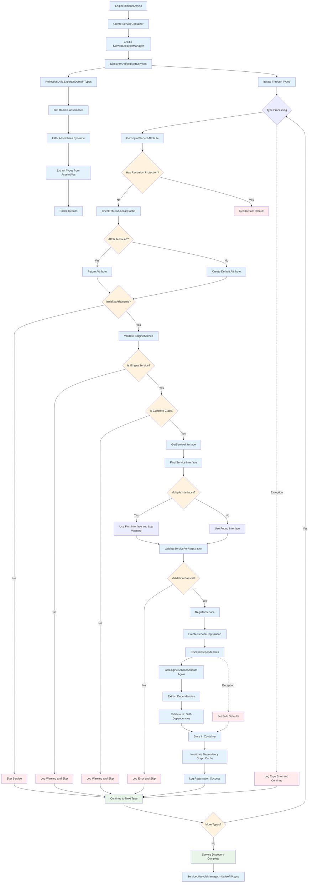

# Service Discovery & Registration Flow

This diagram shows how services are discovered via reflection and registered in the ServiceContainer during engine initialization.

## Key Phases

### 1. Reflection-Based Discovery
- Uses `ReflectionUtils.ExportedDomainTypes` to scan assemblies
- Filters assemblies to only include project-specific code
- Handles assembly loading errors gracefully

### 2. Attribute Processing
- Gets `EngineServiceAttribute` from each type
- Has recursion protection to prevent infinite loops
- Creates default attributes for types without explicit attributes

### 3. Service Validation
- Ensures types implement `IEngineService`
- Validates concrete classes only
- Determines primary service interface

### 4. Registration Process
- Creates `ServiceRegistration` with metadata
- Discovers service dependencies
- Validates against self-dependencies
- Stores in ServiceContainer

### 5. Error Handling
- Continues processing even if individual types fail
- Logs warnings and errors appropriately
- Sets safe defaults when needed