# Test Service Filtering System Guide

## Overview

The Sinkii09 Engine now includes a comprehensive test service filtering system that allows you to:
- ✅ **Exclude test services from production builds** (automatic)
- ✅ **Toggle test services during development** (flexible)
- ✅ **Categorize services for better organization** (scalable)
- ✅ **Multiple layers of protection** (fail-safe)

## How It Works

### 🛡️ Multiple Protection Layers

The system provides **4 layers of protection** to ensure test services never leak into production:

```mermaid
flowchart TD
    A[Service Discovery] --> B{Layer 1: Assembly Available?}
    B -->|No| C[❌ Skip - Test assembly excluded from build]
    B -->|Yes| D{Layer 2: Development Build?}
    D -->|No| E[❌ Skip - Production build protection]
    D -->|Yes| F{Layer 3: Explicitly Enabled?}
    F -->|No| G[❌ Skip - Not enabled via define symbol]
    F -->|Yes| H{Layer 4: Service Category Check}
    H -->|Test Service| I[✅ Include Test Service]
    H -->|Regular Service| J[✅ Include Regular Service]
    
    classDef protection fill:#ffebee
    classDef success fill:#e8f5e8
    classDef decision fill:#fff3e0
    
    class C,E,G protection
    class I,J success
    class B,D,F,H decision
```



## Usage Examples

### 1. **Basic Test Service Creation**

```csharp
[EngineService(ServiceCategory.Test, ServicePriority.Low)]
public class MyTestService : IEngineService
{
    public async UniTask<ServiceInitializationResult> InitializeAsync(
        IServiceProvider provider, 
        CancellationToken cancellationToken = default)
    {
        Debug.Log("Test service initialized - only in development!");
        return ServiceInitializationResult.Success();
    }
    
    // ... other IEngineService methods
}
```

### 2. **Enable Test Services During Development**

#### Via Unity Menu:
1. Go to `Engine > Development > Toggle Test Services`
2. Check mark indicates current state
3. Changes take effect after script recompilation

#### Via Script:
```csharp
#if UNITY_EDITOR
// Enable test services
TestToggle.ToggleTestServices(); // Toggles current state
#endif
```

### 3. **Check Test Service Status**

```csharp
// Runtime check
bool shouldInclude = ServiceTestUtils.ShouldIncludeTestServices();
Debug.Log($"Test services enabled: {shouldInclude}");

// Get detailed status
string status = ServiceTestUtils.GetTestServiceStatus();
Debug.Log(status); // e.g., "Test services included: Unity Editor play mode"

// Log current configuration
ServiceTestUtils.LogTestServiceConfiguration();
```

### 4. **Service Categories**

```csharp
// Core engine functionality
[EngineService(ServiceCategory.Core, ServicePriority.High)]
public class EngineManagerService : IEngineService { }

// Gameplay systems
[EngineService(ServiceCategory.Gameplay, ServicePriority.Medium)]
public class ActorService : IEngineService { }

// Development tools
[EngineService(ServiceCategory.Development, ServicePriority.Low)]
public class DebugConsoleService : IEngineService { }

// Test/Mock services
[EngineService(ServiceCategory.Test, ServicePriority.Low)]
public class MockDataService : IEngineService { }
```

## Configuration States

### ✅ **Production Builds (Automatic)**
- Test assembly completely excluded
- Zero performance impact
- No test services available

### 🔧 **Development Builds**
- Test assembly available
- Test services controllable via menu/script
- Default: **Disabled** (safe)

### 🛠️ **Unity Editor**
- Full flexibility
- Test services available during play mode
- Easy toggling via menu

## Technical Details

### Service Detection Logic

The system identifies test services using multiple criteria:

```csharp
public static bool IsTestService(Type serviceType)
{
    // 1. Namespace-based detection
    if (serviceType.Namespace?.Contains(".Test") == true) return true;
    
    // 2. Attribute-based detection  
    var attr = serviceType.GetEngineServiceAttribute();
    if (attr.Category == ServiceCategory.Test) return true;
    
    // 3. Name-based detection (fallback)
    if (serviceType.Name.StartsWith("Mock")) return true;
    
    return false;
}
```

### Include/Exclude Logic

```csharp
public static bool ShouldIncludeTestServices()
{
    #if !UNITY_INCLUDE_TESTS
    return false; // Assembly protection
    #endif
    
    #if !DEVELOPMENT_BUILD && !UNITY_EDITOR  
    return false; // Production protection
    #endif
    
    #if ENABLE_ENGINE_TESTS
    return true; // Explicitly enabled
    #endif
    
    return false; // Default: safe
}
```

### Define Symbols

The system uses these scripting define symbols:

- `UNITY_INCLUDE_TESTS` - Unity's built-in test assembly symbol
- `ENABLE_ENGINE_TESTS` - Engine-specific test enablement
- `DEVELOPMENT_BUILD` - Unity's development build flag

## Service Discovery Integration

During engine initialization, the service discovery process:

1. **Logs test configuration** - Shows current state
2. **Filters test services** - Based on multiple criteria  
3. **Provides detailed logging** - Shows what was included/excluded
4. **Reports statistics** - Counts of services by category

Example log output:
```
🟢 Test services included: Unity Editor play mode
Discovering services with EngineServiceAttribute...
Processing 150 exported types...
Skipping test service: MockHighPriorityService (Category: Test)
Registered service: IActorService -> ActorService (Category: Gameplay, Priority: High, Lifetime: Singleton)
Service discovery completed. Processed 150 types, registered 5 services, skipped 3 test services.
```

## Best Practices

### ✅ **Do:**
- Always use `ServiceCategory.Test` for test services
- Put test services in `.Test` or `.TestHelpers` namespaces
- Use descriptive names like `MockXxxService` or `TestXxxService`
- Test with both enabled/disabled states during development

### ❌ **Don't:**
- Mix test and production services in the same category
- Rely on test services in production code
- Assume test services are always available
- Hardcode test service dependencies

### 🔧 **Development Workflow:**

1. **Create test service** with proper categorization
2. **Enable test services** via menu when needed
3. **Test functionality** with services enabled
4. **Verify exclusion** by disabling and testing again
5. **Build verification** - test services automatically excluded

## Troubleshooting

### Test Services Not Loading
- Check if `Engine > Development > Toggle Test Services` is enabled
- Verify service has `ServiceCategory.Test` attribute
- Check namespace contains `.Test` or similar
- Look for compilation errors in test assembly

### Test Services in Production
- **This should never happen** due to assembly exclusion
- If it does, check your build configuration
- Verify `excludePlatforms` in test assembly definition

### Missing Test Services
- Ensure test assembly is available (`UNITY_INCLUDE_TESTS` defined)
- Check if running in development build or editor
- Verify test service categories are set correctly

## Future Extensions

The category system enables future enhancements:

- **Performance Services** - Profiling and benchmarking
- **Development Tools** - Debug overlays, inspectors
- **Platform-Specific** - Services for specific platforms
- **Feature Flags** - Experimental feature toggles

This provides a solid foundation for organized, maintainable service architecture!