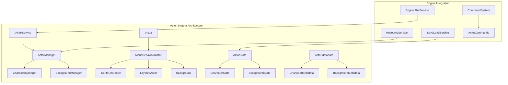

# Actor System Implementation Workplan
## Sinkii09 Engine Enhanced Actor Framework

### 🎯 **Project Overview**

**Objective**: Implement a comprehensive, scalable Actor System for the Sinkii09 Engine based on Naninovel's proven architecture, ensuring full compatibility with existing services and maintaining high performance standards.

**Timeline**: 7 days (January 20-26, 2025)  
**Priority**: High (Core Engine Feature)  
**Dependencies**: ResourceService, SaveLoadService, CommandSystem, ServiceContainer, DOTween Pro

### 🔧 **Key Technical Decisions**
- **Strongly-Typed Enums**: Replace string-based actor types and appearances with compile-time safe enums
- **DOTween Pro Integration**: Leverage advanced animation sequences, custom easing, and performance optimization
- **Enum Serialization**: Serialize enums as integers for performance while maintaining type safety at runtime
- **Extensible Type System**: Allow custom actor types through enum registration while preserving performance benefits

---

## 📋 **Implementation Phases**

### **Phase 1: Core Actor Framework (Days 1-2)**
**Foundation and base interfaces compatible with engine architecture**

#### Day 1: Actor Interface Design & Type System
- [ ] **Create strongly-typed ActorType system** using extensible enum pattern for compile-time safety
- [ ] **Design CharacterAppearance and BackgroundAppearance** composite structures with enum-based properties
- [ ] **Implement base IActor interface** with strongly-typed properties and DOTween Pro integration
- [ ] **Design Actor lifecycle management** (Initialize, Update, Destroy) with proper cancellation token support
- [ ] **Implement ActorState serialization** for save/load compatibility with enum-safe serialization
- [ ] **Create ActorMetadata system** for configuration and type information with enum validation

#### Day 2: Base Actor Implementation & Animation System
- [ ] **Implement MonoBehaviourActor base class** for Unity integration with DOTween Pro support
- [ ] **Create ActorAnimationSystem with DOTween Pro integration** featuring:
  - Sequence-based complex animations
  - Custom easing curve support
  - Animation cancellation and cleanup
  - Tween recycling for performance
- [ ] **Implement ActorResourceManager** for texture/asset loading with enum-based resource path generation
- [ ] **Add comprehensive cancellation token support** for all async operations with proper cleanup
- [ ] **Create ActorStateManager** for state synchronization with type-safe state management

### **Phase 2: Actor Service Architecture (Days 3-4)**
**Service integration and management framework**

#### Day 3: Actor Service Implementation
- [ ] **Create IActorService interface** following engine service patterns
- [ ] **Implement ActorService** with full service lifecycle
- [ ] **Add ActorServiceConfiguration** with ScriptableObject support
- [ ] **Integrate with Engine.GetService<T>()** pattern
- [ ] **Implement actor registry and lookup** with thread-safe operations

#### Day 4: Advanced Actor Management
- [ ] **Create generic ActorManager<T>** for type-specific managers
- [ ] **Implement CharacterManager** as specialized actor manager
- [ ] **Add BackgroundManager** for scene management
- [ ] **Create ActorFactory** for dynamic actor creation
- [ ] **Implement actor pooling** for performance optimization

### **Phase 3: Specialized Actor Types (Day 5)**
**Character and background actor implementations**

#### Day 5: Actor Type Specialization
- [ ] **Implement ICharacterActor interface** with character-specific features
- [ ] **Create SpriteCharacter implementation** with sprite rendering
- [ ] **Add CharacterLookDirection system** (left/right/center facing)
- [ ] **Implement IBackgroundActor interface** for scene backgrounds
- [ ] **Create LayeredActor system** for complex multi-sprite compositions
- [ ] **Add appearance management** with automatic resource loading

### **Phase 4: Command Integration (Day 6)**
**Script command system for actor manipulation**

#### Day 6: Command System Integration
- [ ] **Create ShowActorCommand** for actor visibility control
- [ ] **Implement ChangeActorAppearanceCommand** for appearance changes
- [ ] **Add MoveActorCommand** for position/rotation/scale changes
- [ ] **Create RemoveActorCommand** for actor cleanup
- [ ] **Implement batch operations** for multiple actor manipulation
- [ ] **Add named pose system** for predefined actor states

### **Phase 5: Testing and Integration (Day 7)**
**Comprehensive testing and final integration**

#### Day 7: Testing and Documentation
- [ ] **Create ActorSystemTests** with comprehensive test coverage
- [ ] **Test save/load integration** with SaveLoadService
- [ ] **Performance testing** and optimization validation
- [ ] **Integration testing** with existing engine services
- [ ] **Update engine documentation** with actor system usage
- [ ] **Create example scripts** demonstrating actor system features

---

## 🏗️ **Technical Architecture**

### **Core Components Overview**



### **Service Integration Pattern with Strongly-Typed System**

```csharp
[EngineService(ServiceCategory.Core, ServicePriority.High)]
[ServiceConfiguration(typeof(ActorServiceConfiguration))]
public class ActorService : IActorService, IMemoryPressureResponder
{
    private readonly IResourceService _resourceService;
    private readonly ActorServiceConfiguration _config;
    private readonly ConcurrentDictionary<string, IActor> _actors;
    private readonly Dictionary<ActorType, IActorManager> _actorManagers;
    
    public ActorService(
        ActorServiceConfiguration config,
        IResourceService resourceService)
    {
        _config = config;
        _resourceService = resourceService;
        _actors = new ConcurrentDictionary<string, IActor>();
        _actorManagers = new Dictionary<ActorType, IActorManager>();
    }
    
    // Type-safe actor creation
    public async UniTask<T> CreateActorAsync<T>(string id, ActorType actorType, CancellationToken cancellationToken = default) 
        where T : IActor
    {
        var manager = GetActorManager<T>(actorType);
        return await manager.CreateActorAsync(id, cancellationToken);
    }
}
```

---

## 📊 **Key Features and Capabilities**

### **1. Strongly-Typed Actor System**
- **Compile-Time Safety**: ActorType and appearance enums prevent runtime errors
- **Performance Optimization**: Integer-based enum comparisons instead of string operations
- **IntelliSense Support**: Full autocomplete for valid actor types and appearances
- **Extensibility**: Enum registration system allows custom types while maintaining type safety

### **2. Actor Lifecycle Management**
- **Async Initialization**: Full UniTask integration with cancellation support
- **Resource Management**: Automatic loading/unloading with ResourceService integration
- **State Persistence**: Complete save/load support via SaveLoadService with enum serialization
- **Memory Optimization**: Object pooling and resource reference counting

### **3. DOTween Pro Animation System**
- **Advanced Sequences**: Complex multi-property animations with precise timing control
- **Custom Easing**: Full support for DOTween's Ease enum and AnimationCurve integration
- **Performance Optimization**: Tween recycling and automatic cleanup for memory efficiency
- **Cancellation Support**: All animations respect cancellation tokens with proper cleanup

### **4. Type-Safe Appearance Management**
- **Composite Structures**: CharacterAppearance and BackgroundAppearance with enum-based properties
- **Automatic Resource Paths**: Enum-based path generation for organized asset management
- **Validation System**: Compile-time and runtime validation of appearance combinations
- **Fallback System**: Default appearances when specific combinations fail to load

### **5. Specialized Actor Types with Strong Typing**

#### **Character Actors**
```csharp
public interface ICharacterActor : IActor
{
    new CharacterAppearance Appearance { get; set; }
    CharacterLookDirection LookDirection { get; set; }
    Color CharacterColor { get; set; }
    
    UniTask ChangeAppearanceAsync(CharacterAppearance appearance, float duration, CancellationToken cancellationToken = default);
    UniTask ChangeExpressionAsync(CharacterExpression expression, float duration = 0.5f, CancellationToken cancellationToken = default);
    UniTask ChangePoseAsync(CharacterPose pose, float duration = 1.0f, CancellationToken cancellationToken = default);
    UniTask ChangeLookDirectionAsync(CharacterLookDirection direction, float duration, CancellationToken cancellationToken = default);
    UniTask SpeakAsync(string message, CancellationToken cancellationToken = default);
}
```

#### **Background Actors**
```csharp
public interface IBackgroundActor : IActor
{
    new BackgroundAppearance Appearance { get; set; }
    SceneTransitionType TransitionType { get; set; }
    
    UniTask ChangeAppearanceAsync(BackgroundAppearance appearance, float duration, CancellationToken cancellationToken = default);
    UniTask TransitionToAsync(BackgroundAppearance newBackground, SceneTransitionType transition, float duration, CancellationToken cancellationToken = default);
    UniTask ChangeLocationAsync(SceneLocation location, int variantId = 0, float duration = 2.0f, CancellationToken cancellationToken = default);
}
```

### **6. Type-Safe Command System Integration**

```csharp
// Show character with enum-based expressions and poses
@show char:Alice expression:Happy pose:Standing pos:center fade:1.0

// Change character appearance with type safety
@char Alice expression:Surprised pose:Pointing outfit:1 duration:0.5

// Change background with enum-based locations
@bg location:Classroom variant:1 transition:slide duration:2.0

// Move multiple characters simultaneously
@move char:Alice pos:left,char:Bob pos:right duration:1.5

// Type-safe batch expression changes
@expression Alice:Happy Bob:Confused Charlie:Surprised duration:1.0
```

#### **Command Implementation Example**
```csharp
[CommandAlias("show")]
public class ShowCharacterCommand : ICommand
{
    [RequiredParameter]
    public CommandParameter<string> CharacterName { get; set; }
    
    public CommandParameter<CharacterExpression> Expression { get; set; } = CharacterExpression.Neutral;
    public CommandParameter<CharacterPose> Pose { get; set; } = CharacterPose.Standing;
    public CommandParameter<int> Outfit { get; set; } = 0;
    public CommandParameter<float> Duration { get; set; } = 1.0f;
    
    public async UniTask ExecuteAsync(CancellationToken cancellationToken = default)
    {
        var actorService = Engine.GetService<IActorService>();
        var appearance = new CharacterAppearance(Expression.Value, Pose.Value, Outfit.Value);
        var character = await actorService.GetActorAsync<ICharacterActor>(CharacterName.Value);
        await character.ChangeAppearanceAsync(appearance, Duration.Value, cancellationToken);
    }
}
```

---

## 📋 **Core Enum Definitions**

### **Actor Type System**
```csharp
// Extensible actor type system
public struct ActorType : IEquatable<ActorType>
{
    public readonly int Value;
    public readonly string Name;
    
    // Built-in types
    public static readonly ActorType Character = new(1, nameof(Character));
    public static readonly ActorType Background = new(2, nameof(Background));
    public static readonly ActorType Prop = new(3, nameof(Prop));
    public static readonly ActorType Effect = new(4, nameof(Effect));
    
    // Custom type registration system
    public static ActorType Register(int value, string name);
}

// Character-specific enums
public enum CharacterExpression
{
    Neutral = 0, Happy = 1, Sad = 2, Angry = 3, 
    Surprised = 4, Confused = 5, Embarrassed = 6, Determined = 7
}

public enum CharacterPose
{
    Standing = 0, Sitting = 1, Walking = 2, Running = 3,
    Waving = 4, Pointing = 5, Thinking = 6, Sleeping = 7
}

public enum CharacterLookDirection
{
    Center = 0, Left = 1, Right = 2, Up = 3, Down = 4
}

// Background-specific enums  
public enum BackgroundType
{
    Scene = 0, Environment = 1, Sky = 2, Overlay = 3, UI = 4
}

public enum SceneLocation
{
    Classroom = 0, Library = 1, Cafeteria = 2, Hallway = 3,
    Bedroom = 4, Park = 5, Beach = 6, Forest = 7
}

public enum SceneTransitionType
{
    Fade = 0, Slide = 1, Wipe = 2, Dissolve = 3, None = 4
}

// Composite appearance structures
[Serializable]
public struct CharacterAppearance : IEquatable<CharacterAppearance>
{
    public CharacterExpression Expression;
    public CharacterPose Pose;
    public int OutfitId;
    
    public string GetResourcePath(string characterName)
        => $"Characters/{characterName}/{Expression}_{Pose}_{OutfitId:D2}";
}

[Serializable]
public struct BackgroundAppearance : IEquatable<BackgroundAppearance>
{
    public BackgroundType Type;
    public SceneLocation Location;
    public int VariantId;
    
    public string GetResourcePath()
        => $"Backgrounds/{Type}/{Location}_{VariantId:D2}";
}
```

---

## 🔧 **Service Configuration**

### **Enhanced ActorServiceConfiguration with DOTween Pro & Type Safety**

```csharp
[CreateAssetMenu(menuName = "Engine/Configurations/Actor Service")]
public class ActorServiceConfiguration : ServiceConfigurationBase
{
    [Header("Actor Management")]
    public int MaxActorsPerType = 50;
    public bool EnableActorPooling = true;
    public float DefaultTransitionDuration = 1.0f;
    public ActorType[] SupportedActorTypes = { ActorType.Character, ActorType.Background, ActorType.Prop };
    
    [Header("Resource Management")]
    public int ResourceCacheSize = 100;
    public bool PreloadDefaultAppearances = true;
    public TextureFormat DefaultTextureFormat = TextureFormat.RGBA32;
    public string ResourceBasePath = "Actors";
    
    [Header("DOTween Pro Animation Settings")]
    public int MaxConcurrentAnimationsPerActor = 5;
    public Ease DefaultEase = Ease.OutQuad;
    public bool EnableTimelineSupport = true;
    public bool RecycleTweens = true;
    public float DefaultFadeDuration = 1.0f;
    public bool EnableSequenceOptimization = true;
    
    [Header("Performance")]
    public bool EnableBatchOperations = true;
    public int MaxConcurrentAnimations = 20;
    public float MemoryPressureThreshold = 0.8f;
    public bool EnableAsyncResourceLoading = true;
    
    [Header("Character Settings")]
    public CharacterExpression[] DefaultSupportedExpressions = 
    {
        CharacterExpression.Neutral, CharacterExpression.Happy, CharacterExpression.Sad
    };
    public CharacterPose[] DefaultSupportedPoses = 
    {
        CharacterPose.Standing, CharacterPose.Sitting
    };
    public Vector3[] PredefinedPositions = 
    {
        new Vector3(-3f, 0f, 0f), // left
        new Vector3(0f, 0f, 0f),  // center  
        new Vector3(3f, 0f, 0f)   // right
    };
    public string[] PositionNames = { "left", "center", "right" };
    
    [Header("Background Settings")]
    public SceneLocation[] DefaultSupportedLocations = 
    {
        SceneLocation.Classroom, SceneLocation.Library, SceneLocation.Cafeteria
    };
    public SceneTransitionType DefaultTransition = SceneTransitionType.Fade;
    public float BackgroundTransitionDuration = 2.0f;
    
    [Header("Type Safety & Validation")]
    public bool EnableStrictTypeValidation = true;
    public bool LogEnumConversionErrors = true;
    public bool FallbackToDefaultOnError = true;
}
```

---

## 💾 **Save/Load Integration**

### **Type-Safe Actor State Management**

```csharp
[System.Serializable]
public class ActorState
{
    public string Id;
    public int ActorTypeValue; // ActorType serialized as int for efficiency
    public bool Visible;
    public Vector3 Position;
    public Quaternion Rotation;
    public Vector3 Scale;
    public Color TintColor;
    
    // Type-safe ActorType property
    public ActorType ActorType 
    {
        get => (ActorType)ActorTypeValue;
        set => ActorTypeValue = value.Value;
    }
    
    public virtual void ApplyToActor(IActor actor)
    {
        actor.Visible = Visible;
        actor.Position = Position;
        actor.Rotation = Rotation;
        actor.Scale = Scale;
        actor.TintColor = TintColor;
    }
    
    public virtual void CaptureFromActor(IActor actor)
    {
        Id = actor.Id;
        ActorType = actor.ActorType;
        Visible = actor.Visible;
        Position = actor.Position;
        Rotation = actor.Rotation;
        Scale = actor.Scale;
        TintColor = actor.TintColor;
    }
}

[System.Serializable]
public class CharacterState : ActorState
{
    // Enum-based serialization for performance and safety
    public int ExpressionValue;
    public int PoseValue;
    public int LookDirectionValue;
    public int OutfitId;
    public Color CharacterColor;
    
    // Type-safe properties
    public CharacterExpression Expression
    {
        get => (CharacterExpression)ExpressionValue;
        set => ExpressionValue = (int)value;
    }
    
    public CharacterPose Pose
    {
        get => (CharacterPose)PoseValue;
        set => PoseValue = (int)value;
    }
    
    public CharacterLookDirection LookDirection
    {
        get => (CharacterLookDirection)LookDirectionValue;
        set => LookDirectionValue = (int)value;
    }
    
    public CharacterAppearance Appearance
    {
        get => new CharacterAppearance(Expression, Pose, OutfitId);
        set
        {
            Expression = value.Expression;
            Pose = value.Pose;
            OutfitId = value.OutfitId;
        }
    }
    
    public override void ApplyToActor(IActor actor)
    {
        base.ApplyToActor(actor);
        if (actor is ICharacterActor character)
        {
            character.Appearance = Appearance;
            character.LookDirection = LookDirection;
            character.CharacterColor = CharacterColor;
        }
    }
    
    public override void CaptureFromActor(IActor actor)
    {
        base.CaptureFromActor(actor);
        if (actor is ICharacterActor character)
        {
            Appearance = character.Appearance;
            LookDirection = character.LookDirection;
            CharacterColor = character.CharacterColor;
        }
    }
}

[System.Serializable]
public class BackgroundState : ActorState
{
    public int BackgroundTypeValue;
    public int LocationValue;
    public int VariantId;
    public int TransitionTypeValue;
    
    // Type-safe properties
    public BackgroundType BackgroundType
    {
        get => (BackgroundType)BackgroundTypeValue;
        set => BackgroundTypeValue = (int)value;
    }
    
    public SceneLocation Location
    {
        get => (SceneLocation)LocationValue;
        set => LocationValue = (int)value;
    }
    
    public SceneTransitionType TransitionType
    {
        get => (SceneTransitionType)TransitionTypeValue;
        set => TransitionTypeValue = (int)value;
    }
    
    public BackgroundAppearance Appearance
    {
        get => new BackgroundAppearance { Type = BackgroundType, Location = Location, VariantId = VariantId };
        set
        {
            BackgroundType = value.Type;
            Location = value.Location;
            VariantId = value.VariantId;
        }
    }
}
```

### **SaveLoadService Integration**

```csharp
public class ActorSystemSaveData
{
    public List<ActorState> ActiveActors = new List<ActorState>();
    public Dictionary<string, string> ActorMetadata = new Dictionary<string, string>();
    public string CurrentBackground;
    public Dictionary<string, object> CustomActorData = new Dictionary<string, object>();
}
```

---

## ⚡ **Performance Optimizations**

### **1. Object Pooling**
- **Actor Pool**: Reuse actor GameObjects to minimize allocation/deallocation
- **State Pool**: Pool actor state objects for save/load operations
- **Animation Pool**: Reuse animation/tween objects

### **2. Resource Management**
- **Reference Counting**: Track resource usage to prevent premature unloading
- **Smart Caching**: LRU cache for frequently used textures and assets
- **Lazy Loading**: Load resources only when needed, unload when unused

### **3. Memory Pressure Response**
```csharp
public void RespondToMemoryPressure(MemoryPressureLevel level)
{
    switch (level)
    {
        case MemoryPressureLevel.Low:
            CleanupUnusedResources();
            break;
        case MemoryPressureLevel.Medium:
            ClearResourceCache();
            DeactivateInvisibleActors();
            break;
        case MemoryPressureLevel.High:
            EmergencyCleanup();
            break;
    }
}
```

### **4. Rendering Optimizations**
- **Sprite Batching**: Combine multiple sprites for efficient rendering
- **Texture Atlasing**: Pack small textures to reduce draw calls
- **Culling**: Hide off-screen actors from rendering pipeline

---

## 🧪 **Testing Strategy**

### **Unit Tests**
```csharp
[TestFixture]
public class ActorServiceTests
{
    [Test]
    public async Task CreateActor_ShouldInitializeCorrectly()
    {
        // Test actor creation and initialization
    }
    
    [Test]
    public async Task SaveLoadActorState_ShouldPreserveProperties()
    {
        // Test save/load integration
    }
    
    [Test]
    public async Task AnimateActor_ShouldRespectCancellation()
    {
        // Test animation cancellation
    }
}
```

### **Integration Tests**
- **Service Container Integration**: Verify proper service registration and resolution
- **ResourceService Integration**: Test resource loading and management
- **SaveLoadService Integration**: Validate state persistence
- **Command System Integration**: Test script command execution

### **Performance Tests**
- **Memory Usage**: Monitor memory allocation during actor operations
- **Animation Performance**: Measure frame rate during complex animations
- **Load Time**: Test scene loading performance with multiple actors
- **Concurrent Operations**: Validate thread safety with parallel operations

---

## 📚 **Usage Examples**

### **Basic Actor Management**

```csharp
// Get actor service
var actorService = Engine.GetService<IActorService>();

// Create and show a character
var alice = await actorService.CreateActorAsync<ICharacterActor>("Alice");
await alice.ChangeAppearanceAsync("Alice.Happy", 1.0f);
await alice.ChangeVisibilityAsync(true, 1.0f);

// Move character to center position
await alice.ChangePositionAsync(Vector3.zero, 2.0f, EasingType.EaseInOut);
```

### **Script Commands**

```script
; Show Alice with happy expression at center
@show char:Alice.Happy pos:center fade:1.0

; Alice speaks with character color highlighting
@char Alice speak:"Hello! I'm excited to meet you!"

; Change Alice's expression and look direction
@char Alice appear:Surprised look:left duration:0.5

; Move Alice to left while Bob enters from right
@move char:Alice pos:left duration:1.5
@show char:Bob.Neutral pos:right fade:1.0 delay:0.5

; Change background with transition
@bg classroom transition:slide duration:2.0

; Remove all characters
@remove char:* fade:1.0
```

### **Advanced Usage**

```csharp
// Batch operations for multiple actors
var characters = new[] { "Alice", "Bob", "Charlie" };
var tasks = characters.Select(name => 
    actorService.GetActorAsync<ICharacterActor>(name)
        .ContinueWith(actor => actor.Result?.ChangeVisibilityAsync(false, 1.0f))
);
await UniTask.WhenAll(tasks);

// Custom pose with state management
var pose = new CharacterState
{
    Position = new Vector3(-2, 0, 0),
    LookDirection = CharacterLookDirection.Right,
    Appearance = "Alice.Waving"
};
await alice.ApplyStateAsync(pose, 1.5f);

// Memory-efficient background preloading
await actorService.PreloadBackgroundsAsync(new[] { "classroom", "library", "cafeteria" });
```

---

## 🔗 **Service Dependencies**

### **Required Services**
1. **ResourceService**: Asset loading and management
2. **SaveLoadService**: State persistence
3. **ServiceContainer**: Dependency injection and service resolution

### **Optional Services**
1. **AudioService**: Character voice and sound effects
2. **UIService**: Character dialogue integration
3. **LocalizationService**: Multi-language asset support

### **Integration Points**

```csharp
// Service registration
[EngineService(ServiceCategory.Core, ServicePriority.High)]
[RequiredServices(typeof(IResourceService), typeof(ISaveLoadService))]
public class ActorService : IActorService
{
    // Constructor injection of dependencies
    public ActorService(
        ActorServiceConfiguration config,
        IResourceService resourceService,
        ISaveLoadService saveLoadService)
    {
        // Initialization with injected services
    }
}
```

---

## 🎯 **Success Criteria**

### **Functional Requirements**
- [ ] **Actor Creation**: Create, initialize, and manage multiple actor types
- [ ] **Animation System**: Smooth property transitions with easing and cancellation
- [ ] **Save/Load Integration**: Complete state persistence with SaveLoadService
- [ ] **Resource Management**: Efficient loading/unloading with ResourceService
- [ ] **Command Integration**: Script commands for all actor operations
- [ ] **Performance**: Maintain 60fps with 20+ active actors

### **Quality Requirements**
- [ ] **Memory Efficiency**: <100MB memory usage for typical visual novel scene
- [ ] **Load Performance**: <2 seconds to load scene with 10 characters
- [ ] **Thread Safety**: All operations safe for concurrent access
- [ ] **Error Handling**: Graceful degradation when resources fail to load
- [ ] **Extensibility**: Easy to add new actor types and behaviors

### **Integration Requirements**
- [ ] **Service Architecture**: Full compatibility with engine service container
- [ ] **Configuration System**: ScriptableObject-based configuration with validation
- [ ] **Testing Coverage**: >90% test coverage for all core functionality
- [ ] **Documentation**: Comprehensive usage documentation and examples

---

## 🔄 **Maintenance and Extension**

### **Adding New Actor Types**

```csharp
// 1. Define new actor interface
public interface IVehicleActor : IActor
{
    float Speed { get; set; }
    VehicleType Type { get; set; }
    UniTask DriveToAsync(Vector3 destination, float speed, CancellationToken cancellationToken = default);
}

// 2. Create actor implementation
public class Vehicle : MonoBehaviourActor, IVehicleActor
{
    // Implementation details
}

// 3. Add to actor service registration
[ActorType("vehicle")]
public class VehicleManager : ActorManager<IVehicleActor, VehicleState, VehicleMetadata>
{
    // Manager implementation
}
```

### **Extending Command System**

```csharp
[CommandAlias("drive")]
public class DriveVehicleCommand : ICommand
{
    [RequiredParameter]
    public CommandParameter<string> VehicleId { get; set; }
    
    [RequiredParameter]
    public CommandParameter<Vector3> Destination { get; set; }
    
    public async UniTask ExecuteAsync(CancellationToken cancellationToken = default)
    {
        var actorService = Engine.GetService<IActorService>();
        var vehicle = await actorService.GetActorAsync<IVehicleActor>(VehicleId.Value);
        await vehicle.DriveToAsync(Destination.Value, 5.0f, cancellationToken);
    }
}
```

---

## 📈 **Future Enhancements**

### **Phase 2 Features** (Post-Initial Implementation)
- **Multi-layer Composition**: Complex sprites with separate layers for clothing, expressions, etc.
- **Physics Integration**: Actors with physics-based movement and collision
- **AI Behaviors**: Basic AI for autonomous actor behaviors
- **Custom Shaders**: Specialized rendering effects for actors

### **Advanced Features**
- **Lip Sync**: Automatic mouth animation based on audio
- **Motion Capture**: Import mocap data for realistic character animation
- **Procedural Animation**: Algorithmic generation of character movements
- **VR Support**: Actor interaction in virtual reality environments

---

## ⚠️ **Risk Mitigation**

### **Technical Risks**
1. **Performance Degradation**: Mitigated by object pooling and resource management
2. **Memory Leaks**: Prevented by reference counting and proper disposal patterns
3. **Thread Safety Issues**: Addressed by concurrent collections and locking strategies
4. **Save/Load Corruption**: Handled by validation and fallback mechanisms

### **Integration Risks**
1. **Service Dependencies**: Minimized by clear interfaces and dependency injection
2. **Breaking Changes**: Prevented by comprehensive testing and versioning
3. **Configuration Complexity**: Managed by sensible defaults and validation
4. **Resource Loading Failures**: Handled by fallback resources and error recovery

---

## 📋 **Deliverables Checklist**

### **Code Deliverables**
- [ ] Core actor interfaces and base classes
- [ ] ActorService implementation with full lifecycle
- [ ] Character and Background actor specializations
- [ ] Command system integration
- [ ] Configuration system with ScriptableObjects
- [ ] Save/load integration with state management

### **Documentation Deliverables**
- [ ] API documentation with examples
- [ ] Integration guide for engine services
- [ ] Performance optimization guide
- [ ] Troubleshooting and FAQ
- [ ] Migration guide for existing projects

### **Testing Deliverables**
- [ ] Unit test suite with comprehensive coverage
- [ ] Integration tests for service dependencies
- [ ] Performance benchmarks and optimization validation
- [ ] Example scenes demonstrating all features

---

## 🎉 **Implementation Success**

Upon completion, the Actor System will provide:

1. **Robust Foundation**: Type-safe, extensible actor management
2. **Engine Integration**: Seamless compatibility with all engine services
3. **Developer Experience**: Intuitive APIs and comprehensive documentation
4. **Performance**: Optimized for real-world visual novel and game scenarios
5. **Maintainability**: Clean architecture supporting future enhancements

This implementation will establish the Actor System as a core pillar of the Sinkii09 Engine, providing developers with powerful tools for character and scene management while maintaining the engine's standards for performance, reliability, and extensibility.