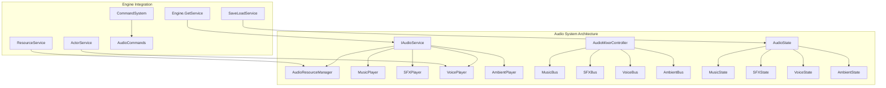

# Audio System Implementation Workplan
## Sinkii09 Engine Enhanced Audio Framework

### 🎯 **Project Overview**

**Objective**: Implement a comprehensive, high-performance AudioService for the Sinkii09 Engine with full Unity integration, following the established enhanced service architecture patterns.

**Timeline**: 8 days (January 27 - February 3, 2025)  
**Priority**: High (Core Engine Feature)  
**Dependencies**: ResourceService, ActorService, ServiceContainer, Unity AudioMixer

### 🔧 **Key Technical Decisions**
- **Unity AudioMixer Integration**: Professional audio mixing and effects processing
- **Strongly-Typed Audio Categories**: Enum-based system for Music, SFX, Voice, Ambient
- **Resource Streaming**: Efficient loading and streaming for large audio files
- **Spatial Audio Support**: 3D positioning and environmental audio effects
- **DOTween Pro Integration**: Smooth audio transitions and fade effects

---

## 📋 **Implementation Phases**

### **Phase 1: Core Audio Architecture (Days 1-2)**
**Foundation and service infrastructure following engine patterns**

#### Day 1: Audio Interface Design & Type System
- [ ] **Create IAudioService interface** following enhanced service patterns
- [ ] **Design strongly-typed AudioCategory system** (Music, SFX, Voice, Ambient, UI)
- [ ] **Implement base audio resource types** with enum-based categorization
- [ ] **Design AudioServiceConfiguration** ScriptableObject with comprehensive settings
- [ ] **Create audio event system** for service communication and monitoring
- [ ] **Implement audio resource metadata** for efficient asset management

#### Day 2: AudioService Implementation & Resource Management
- [ ] **Implement AudioService base class** with dependency injection
- [ ] **Create AudioResourceManager** with ResourceService integration
- [ ] **Add audio streaming support** for large music files
- [ ] **Implement audio caching system** with LRU eviction policies
- [ ] **Create audio validation system** for format compatibility
- [ ] **Add comprehensive cancellation token support** for async operations

### **Phase 2: Audio Types & Management (Days 3-4)**
**Audio categorization and advanced management features**

#### Day 3: Audio Category Implementation
- [ ] **Create MusicPlayer system** with playlist and queue management
- [ ] **Implement SFXPlayer** with pooling and rapid-fire support
- [ ] **Add VoicePlayer system** with character integration
- [ ] **Create AmbientPlayer** for environmental audio loops
- [ ] **Implement audio priority system** for channel management
- [ ] **Add audio bus management** with Unity AudioMixer integration

#### Day 4: Advanced Audio Features
- [ ] **Implement spatial audio system** with 3D positioning
- [ ] **Create audio occlusion system** for environmental effects
- [ ] **Add dynamic range compression** and audio ducking
- [ ] **Implement audio effects system** (reverb, echo, filters)
- [ ] **Create audio visualization support** for debugging
- [ ] **Add audio performance monitoring** and metrics

### **Phase 3: Playback System (Days 5-6)**
**Comprehensive playback controls and transitions**

#### Day 5: Audio Playback Implementation
- [ ] **Create AudioPlayer component pooling** for performance
- [ ] **Implement audio sequence management** for complex compositions
- [ ] **Add crossfade transitions** with DOTween Pro integration
- [ ] **Create audio loop management** with seamless boundaries
- [ ] **Implement volume control hierarchy** (master, category, individual)
- [ ] **Add audio timing synchronization** for rhythm-based features

#### Day 6: Audio Transitions & Effects
- [ ] **Implement fade in/out system** with configurable curves
- [ ] **Create audio ducking** for voice priority
- [ ] **Add audio snapshots** for instant audio state changes
- [ ] **Implement audio timeline integration** for scripted sequences
- [ ] **Create audio trigger system** for proximity-based audio
- [ ] **Add audio event scheduling** for precise timing control

### **Phase 4: Integration & Commands (Days 7-8)**
**Script command system and service integration**

#### Day 7: Command System Integration
- [ ] **Create PlayAudioCommand** for script-based audio control
- [ ] **Implement StopAudioCommand** with fade-out options
- [ ] **Add VolumeCommand** for dynamic volume changes
- [ ] **Create AudioStateCommand** for complex audio scenarios
- [ ] **Implement batch audio operations** for simultaneous control
- [ ] **Add audio preset system** for quick audio configurations

#### Day 8: Testing and Integration
- [ ] **Create AudioSystemTests** with comprehensive coverage
- [ ] **Test ActorService integration** for character voices
- [ ] **Performance testing** and memory optimization
- [ ] **Integration testing** with existing engine services
- [ ] **Create example audio scripts** demonstrating all features
- [ ] **Update engine documentation** with audio system usage

---

## 🏗️ **Technical Architecture**

### **Core Components Overview**



### **Service Integration Pattern**

```csharp
[EngineService(ServiceCategory.Audio, ServicePriority.High)]
[ServiceConfiguration(typeof(AudioServiceConfiguration))]
public class AudioService : IAudioService, IMemoryPressureResponder
{
    private readonly IResourceService _resourceService;
    private readonly AudioServiceConfiguration _config;
    private readonly ConcurrentDictionary<string, IAudioPlayer> _activePlayers;
    private readonly Dictionary<AudioCategory, IAudioBus> _audioBuses;
    
    public AudioService(
        AudioServiceConfiguration config,
        IResourceService resourceService)
    {
        _config = config;
        _resourceService = resourceService;
        _activePlayers = new ConcurrentDictionary<string, IAudioPlayer>();
        _audioBuses = new Dictionary<AudioCategory, IAudioBus>();
    }
    
    public async UniTask<IAudioPlayer> PlayAsync(string audioId, AudioCategory category, 
        AudioPlayOptions options = default, CancellationToken cancellationToken = default)
    {
        var bus = GetAudioBus(category);
        var player = await CreatePlayerAsync(audioId, bus, cancellationToken);
        return await player.PlayAsync(options, cancellationToken);
    }
}
```

---

## 📊 **Key Features and Capabilities**

### **1. Unity AudioMixer Integration**
- **Professional Mixing**: Complete integration with Unity's AudioMixer system
- **Dynamic Bus Control**: Runtime control of audio buses and effects
- **Snapshot Management**: Instant audio state changes for different game scenarios
- **Real-time Effects**: Reverb, echo, low-pass filters, and custom effect chains

### **2. Audio Category Management**
- **Music System**: Background music with playlist support, crossfading, and loop management
- **SFX System**: Sound effects with pooling, rapid-fire capability, and priority management
- **Voice System**: Character dialogue with lip-sync integration and subtitle support
- **Ambient System**: Environmental audio loops with spatial positioning and weather integration

### **3. Spatial Audio System**
- **3D Positioning**: Full 3D audio positioning with distance attenuation
- **Environmental Effects**: Occlusion, reflection, and environmental audio processing
- **Audio Zones**: Defined areas with specific audio characteristics
- **Dynamic Range**: Automatic adjustment based on listener position and environment

### **4. Performance Optimization**
- **Audio Streaming**: Efficient streaming for large music files to minimize memory usage
- **Object Pooling**: Reuse AudioSource components to reduce allocation overhead
- **Smart Caching**: Intelligent caching of frequently used audio clips
- **Memory Management**: Automatic cleanup and resource management

### **5. Audio State Management**

```csharp
[System.Serializable]
public class AudioState
{
    public float MasterVolume = 1.0f;
    public float MusicVolume = 0.8f;
    public float SFXVolume = 1.0f;
    public float VoiceVolume = 1.0f;
    public float AmbientVolume = 0.6f;
    public bool MusicMuted = false;
    public bool SFXMuted = false;
    public string CurrentMusicTrack;
    public List<string> ActiveAmbientSounds = new List<string>();
    
    public void ApplyToAudioService(IAudioService audioService)
    {
        audioService.SetMasterVolume(MasterVolume);
        audioService.SetCategoryVolume(AudioCategory.Music, MusicVolume);
        audioService.SetCategoryVolume(AudioCategory.SFX, SFXVolume);
        audioService.SetCategoryVolume(AudioCategory.Voice, VoiceVolume);
        audioService.SetCategoryVolume(AudioCategory.Ambient, AmbientVolume);
        
        if (!string.IsNullOrEmpty(CurrentMusicTrack))
        {
            audioService.PlayMusicAsync(CurrentMusicTrack);
        }
    }
}
```

---

## 🔧 **Service Configuration**

### **Enhanced AudioServiceConfiguration**

```csharp
[CreateAssetMenu(menuName = "Engine/Configurations/Audio Service")]
public class AudioServiceConfiguration : ServiceConfigurationBase
{
    [Header("Audio Management")]
    public int MaxConcurrentSources = 32;
    public bool EnableAudioStreaming = true;
    public float DefaultFadeDuration = 1.0f;
    public AudioCategory[] SupportedCategories = { AudioCategory.Music, AudioCategory.SFX, AudioCategory.Voice, AudioCategory.Ambient };
    
    [Header("Resource Management")]
    public int AudioClipCacheSize = 50;
    public bool PreloadCriticalAudio = true;
    public float StreamingMemoryThreshold = 10f; // MB
    public string AudioResourceBasePath = "Audio";
    
    [Header("Unity AudioMixer Settings")]
    public AudioMixer MasterAudioMixer;
    public string MusicBusName = "Music";
    public string SFXBusName = "SFX";
    public string VoiceBusName = "Voice";
    public string AmbientBusName = "Ambient";
    public bool EnableDynamicRange = true;
    
    [Header("Spatial Audio")]
    public bool EnableSpatialAudio = true;
    public float MaxAudioDistance = 50f;
    public AudioRolloffMode DefaultRolloffMode = AudioRolloffMode.Logarithmic;
    public bool Enable3DOcclusion = true;
    public LayerMask OcclusionLayerMask = -1;
    
    [Header("Performance")]
    public bool EnableAudioPooling = true;
    public int AudioSourcePoolSize = 20;
    public float MemoryPressureThreshold = 0.8f;
    public bool EnableAsyncAudioLoading = true;
    
    [Header("Voice & Character Integration")]
    public bool EnableLipSync = false;
    public bool AutoGenerateSubtitles = false;
    public float VoiceAudioDucking = 0.3f; // Reduce other audio by 30% during voice
    public string CharacterVoiceBasePath = "Audio/Voice/Characters";
    
    [Header("Music System")]
    public bool EnableMusicPlaylists = true;
    public bool EnableMusicCrossfade = true;
    public float DefaultCrossfadeDuration = 3.0f;
    public bool MusicLoopByDefault = true;
    public string MusicBasePath = "Audio/Music";
    
    [Header("SFX System")]
    public bool EnableSFXPooling = true;
    public int MaxSimultaneousSFX = 10;
    public bool EnableSFXPriority = true;
    public string SFXBasePath = "Audio/SFX";
    
    [Header("Ambient System")]
    public bool EnableAmbientLayers = true;
    public int MaxAmbientLayers = 5;
    public bool AmbientAutoLoop = true;
    public string AmbientBasePath = "Audio/Ambient";
    
    [Header("Debug & Development")]
    public bool EnableAudioDebugger = true;
    public bool LogAudioOperations = false;
    public bool ShowAudioGizmos = true;
    public bool EnableAudioProfiling = false;
}
```

---

## 💾 **Save/Load Integration**

### **Audio State Persistence**

```csharp
[System.Serializable]
public class AudioSystemSaveData
{
    public AudioState PlayerAudioSettings = new AudioState();
    public List<string> ActiveMusicPlaylist = new List<string>();
    public Dictionary<string, float> ActiveAmbientSounds = new Dictionary<string, float>();
    public string CurrentAudioSnapshot;
    public Dictionary<string, object> CustomAudioData = new Dictionary<string, object>();
}
```

---

## 🎮 **Script Command Integration**

### **Audio Commands for Script System**

```csharp
// Play background music with crossfade
@play music:MainTheme fadein:3.0 loop:true

// Character voice with automatic ducking
@voice char:Alice clip:greeting_01 duck:0.3 subtitles:true

// Environmental sound effects
@play sfx:footsteps_grass volume:0.8 loop:true

// Ambient audio layers
@ambient forest_base volume:0.6 loop:true
@ambient birds volume:0.4 delay:2.0

// Audio transitions
@fadeout music duration:2.0
@fadein music:BattleTheme duration:1.5

// Audio snapshots for instant mood changes
@snapshot Underwater duration:0.5

// Stop all audio in category
@stop sfx fadeout:1.0
```

#### **Command Implementation Example**
```csharp
[CommandAlias("play")]
public class PlayAudioCommand : ICommand
{
    [RequiredParameter]
    public CommandParameter<string> AudioId { get; set; }
    
    public CommandParameter<AudioCategory> Category { get; set; } = AudioCategory.SFX;
    public CommandParameter<float> Volume { get; set; } = 1.0f;
    public CommandParameter<float> FadeIn { get; set; } = 0.0f;
    public CommandParameter<bool> Loop { get; set; } = false;
    public CommandParameter<Vector3> Position { get; set; } = Vector3.zero;
    
    public async UniTask ExecuteAsync(CancellationToken cancellationToken = default)
    {
        var audioService = Engine.GetService<IAudioService>();
        var options = new AudioPlayOptions
        {
            Volume = Volume.Value,
            FadeInDuration = FadeIn.Value,
            Loop = Loop.Value,
            Position = Position.Value
        };
        
        await audioService.PlayAsync(AudioId.Value, Category.Value, options, cancellationToken);
    }
}
```

---

## 📋 **Core Enum Definitions**

### **Audio Type System**
```csharp
// Main audio categories
public enum AudioCategory
{
    Music = 0,
    SFX = 1,
    Voice = 2,
    Ambient = 3,
    UI = 4,
    System = 5
}

// Audio priority levels
public enum AudioPriority
{
    Low = 0,
    Normal = 1,
    High = 2,
    Critical = 3
}

// Fade types
public enum AudioFadeType
{
    Linear = 0,
    EaseIn = 1,
    EaseOut = 2,
    EaseInOut = 3,
    Custom = 4
}

// Spatial audio modes
public enum SpatialAudioMode
{
    None = 0,
    Simple = 1,
    Full3D = 2,
    Environmental = 3
}

// Audio play options structure
[Serializable]
public struct AudioPlayOptions
{
    public float Volume;
    public float FadeInDuration;
    public float FadeOutDuration;
    public bool Loop;
    public Vector3 Position;
    public SpatialAudioMode SpatialMode;
    public AudioPriority Priority;
    public string Bus;
    public Dictionary<string, object> CustomData;
}
```

---

## ⚡ **Performance Optimizations**

### **1. Audio Streaming System**
- **Smart Streaming**: Automatically stream large audio files (>2MB) to save memory
- **Preload Critical**: Keep essential audio clips in memory for instant playback
- **Compression Detection**: Automatically select optimal compression for different audio types

### **2. Object Pooling**
- **AudioSource Pool**: Reuse AudioSource components to minimize allocation overhead
- **Audio Player Pool**: Pool specialized audio player objects for different categories
- **Effect Pool**: Reuse audio effect instances for performance

### **3. Memory Management**
```csharp
public void RespondToMemoryPressure(MemoryPressureLevel level)
{
    switch (level)
    {
        case MemoryPressureLevel.Low:
            ClearUnusedAudioClips();
            break;
        case MemoryPressureLevel.Medium:
            StopNonCriticalAudio();
            ClearAudioCache();
            break;
        case MemoryPressureLevel.High:
            EmergencyAudioCleanup();
            break;
    }
}
```

### **4. Audio Culling**
- **Distance Culling**: Automatically stop distant audio sources
- **Priority Culling**: Replace lower priority audio when source limit reached
- **Visibility Culling**: Pause audio for off-screen objects

---

## 🧪 **Testing Strategy**

### **Unit Tests**
```csharp
[TestFixture]
public class AudioServiceTests
{
    [Test]
    public async Task PlayMusic_ShouldCrossfadeProperly()
    {
        // Test music crossfading functionality
    }
    
    [Test]
    public async Task VoiceAudio_ShouldDuckBackgroundMusic()
    {
        // Test automatic audio ducking during voice
    }
    
    [Test]
    public async Task SpatialAudio_ShouldUpdateWithDistance()
    {
        // Test 3D spatial audio positioning
    }
}
```

### **Integration Tests**
- **ActorService Integration**: Voice audio triggered by character actions
- **ResourceService Integration**: Audio streaming and caching validation
- **SaveLoadService Integration**: Audio state persistence verification
- **Command System Integration**: Script command execution testing

### **Performance Tests**
- **Memory Usage**: Monitor memory consumption during various audio scenarios
- **Concurrent Playback**: Test performance with maximum concurrent audio sources
- **Streaming Performance**: Validate streaming efficiency for large audio files
- **Audio Latency**: Measure audio response times and optimization effectiveness

---

## 📚 **Usage Examples**

### **Basic Audio Operations**

```csharp
// Get audio service
var audioService = Engine.GetService<IAudioService>();

// Play background music with crossfade
await audioService.PlayMusicAsync("MainTheme", fadeIn: 2.0f, loop: true);

// Play character voice with ducking
await audioService.PlayVoiceAsync("Alice", "greeting_01", duck: true);

// Play environmental sound effect
await audioService.PlaySFXAsync("door_open", volume: 0.8f);

// Play ambient environmental audio
await audioService.PlayAmbientAsync("forest_ambient", loop: true, volume: 0.6f);
```

### **Advanced Audio Control**

```csharp
// Create audio playlist
var playlist = new AudioPlaylist(new[] { "track1", "track2", "track3" });
await audioService.PlayPlaylistAsync(playlist, shuffle: true, crossfade: 3.0f);

// Spatial 3D audio
var options = new AudioPlayOptions
{
    Position = character.transform.position,
    SpatialMode = SpatialAudioMode.Full3D,
    Volume = 1.0f
};
await audioService.PlayAsync("footsteps", AudioCategory.SFX, options);

// Audio ducking for dialogue
using (var duckingScope = audioService.CreateDuckingScope(0.3f))
{
    await audioService.PlayVoiceAsync("Alice", "important_dialogue");
    // Background audio automatically returns to normal volume when scope ends
}
```

### **Script Integration Examples**

```script
; Start background music
@play music:MainTheme fadein:3.0 loop:true

; Character dialogue with voice
@char Alice voice:greeting_01 duck:0.3
Alice: "Welcome to our world!"

; Environmental audio
@ambient forest_base volume:0.6 loop:true
@play sfx:bird_chirp delay:2.0 volume:0.4

; Audio transition for scene change
@fadeout all duration:2.0
@play music:TownTheme fadein:1.5 loop:true
@ambient town_ambient volume:0.5
```

---

## 🔗 **Service Dependencies**

### **Required Services**
1. **ResourceService**: Audio asset loading and streaming
2. **ServiceContainer**: Dependency injection and service resolution

### **Optional Services**
1. **ActorService**: Character voice integration and lip-sync
2. **SaveLoadService**: Audio preferences and state persistence
3. **LocalizationService**: Multi-language audio support

### **Integration Points**

```csharp
// Service registration with dependencies
[EngineService(ServiceCategory.Audio, ServicePriority.High)]
[RequiredServices(typeof(IResourceService))]
[OptionalServices(typeof(IActorService), typeof(ISaveLoadService))]
public class AudioService : IAudioService
{
    public AudioService(
        AudioServiceConfiguration config,
        IResourceService resourceService,
        IActorService actorService = null,
        ISaveLoadService saveLoadService = null)
    {
        // Initialize with required and optional dependencies
    }
}
```

---

## 🎯 **Success Criteria**

### **Functional Requirements**
- [ ] **Multi-Category Audio**: Support for Music, SFX, Voice, Ambient, and UI audio
- [ ] **Unity Integration**: Complete AudioMixer and AudioSource integration
- [ ] **Spatial Audio**: 3D positioning with environmental effects
- [ ] **Streaming Support**: Efficient large file streaming and memory management
- [ ] **Script Commands**: Complete command integration for all audio operations
- [ ] **Performance**: Maintain 60fps with 20+ concurrent audio sources

### **Quality Requirements**
- [ ] **Memory Efficiency**: <50MB memory usage for typical audio scenarios
- [ ] **Audio Quality**: High-fidelity playback with minimal latency (<50ms)
- [ ] **Reliability**: Graceful handling of missing or corrupted audio files
- [ ] **Extensibility**: Easy addition of new audio categories and effects
- [ ] **User Experience**: Smooth transitions and professional audio mixing

### **Integration Requirements**
- [ ] **Service Architecture**: Full compatibility with enhanced service container
- [ ] **Configuration System**: ScriptableObject-based configuration with validation
- [ ] **Testing Coverage**: >90% test coverage for all core audio functionality
- [ ] **Documentation**: Comprehensive usage documentation and examples

---

## 🔄 **Maintenance and Extension**

### **Adding New Audio Categories**

```csharp
// 1. Extend AudioCategory enum
public enum AudioCategory
{
    Music = 0, SFX = 1, Voice = 2, Ambient = 3, UI = 4,
    Dynamic = 5  // New category
}

// 2. Create specialized player
public class DynamicAudioPlayer : BaseAudioPlayer
{
    // Implementation for dynamic audio features
}

// 3. Register in audio service
private void RegisterAudioPlayers()
{
    RegisterPlayer(AudioCategory.Dynamic, typeof(DynamicAudioPlayer));
}
```

### **Custom Audio Effects**

```csharp
public interface IAudioEffect
{
    string EffectName { get; }
    void ApplyEffect(AudioSource source, float intensity);
    void RemoveEffect(AudioSource source);
}

[CreateAssetMenu(menuName = "Audio/Effects/Custom Effect")]
public class CustomAudioEffect : ScriptableObject, IAudioEffect
{
    // Custom effect implementation
}
```

---

## 📈 **Future Enhancements**

### **Phase 2 Features** (Post-Initial Implementation)
- **Dynamic Music System**: Adaptive music based on game state and player actions
- **Advanced Lip Sync**: Automatic lip synchronization with character dialogue
- **Audio Occlusion**: Real-time audio occlusion based on 3D geometry
- **FMOD Integration**: Optional FMOD Studio integration for advanced audio design

### **Advanced Features**
- **Procedural Audio**: Algorithm-generated sound effects and ambient audio
- **VR Spatial Audio**: Enhanced spatial audio for virtual reality experiences
- **Audio Analytics**: Detailed analytics on audio usage and player preferences
- **Real-time Audio Processing**: Dynamic audio effects based on gameplay events

---

## ⚠️ **Risk Mitigation**

### **Technical Risks**
1. **Performance Impact**: Mitigated by object pooling, streaming, and intelligent caching
2. **Memory Leaks**: Prevented by automatic resource cleanup and reference counting
3. **Audio Latency**: Addressed by preloading critical audio and optimization
4. **Unity Version Compatibility**: Handled by version-specific implementations

### **Integration Risks**
1. **Service Dependencies**: Minimized by clear interfaces and optional dependencies
2. **AudioMixer Complexity**: Managed by configuration templates and validation
3. **Platform Differences**: Handled by platform-specific audio settings
4. **Resource Loading Failures**: Addressed by fallback audio and error recovery

---

## 📋 **Deliverables Checklist**

### **Code Deliverables**
- [ ] Core audio interfaces and base classes
- [ ] AudioService implementation with full lifecycle
- [ ] Audio category specializations (Music, SFX, Voice, Ambient)
- [ ] Unity AudioMixer integration
- [ ] Command system integration for script control
- [ ] Configuration system with ScriptableObjects
- [ ] Save/load integration with audio state management

### **Documentation Deliverables**
- [ ] API documentation with comprehensive examples
- [ ] AudioMixer setup guide and best practices
- [ ] Performance optimization guide for audio
- [ ] Troubleshooting guide and FAQ
- [ ] Integration examples with existing engine services

### **Testing Deliverables**
- [ ] Unit test suite with comprehensive coverage
- [ ] Integration tests for service dependencies
- [ ] Performance benchmarks and optimization validation
- [ ] Example scenes demonstrating all audio features

---

## 🎉 **Implementation Success**

Upon completion, the Audio System will provide:

1. **Professional Audio Framework**: Unity AudioMixer integration with advanced mixing capabilities
2. **Performance Optimized**: Efficient streaming, pooling, and memory management
3. **Developer Friendly**: Intuitive APIs, comprehensive documentation, and script integration
4. **Extensible Architecture**: Easy addition of new audio categories and custom effects
5. **Production Ready**: Robust error handling, fallback systems, and comprehensive testing

This implementation will establish the Audio System as a core component of the Sinkii09 Engine, providing developers with professional-grade audio capabilities while maintaining the engine's standards for performance, reliability, and ease of use.